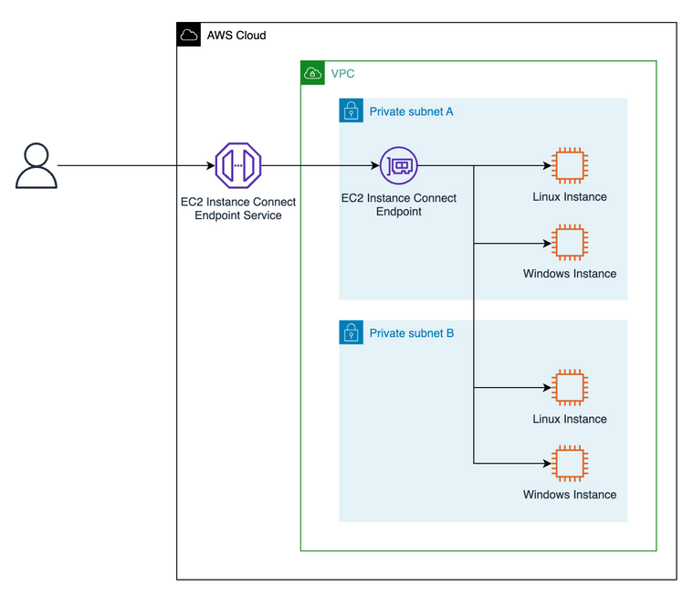
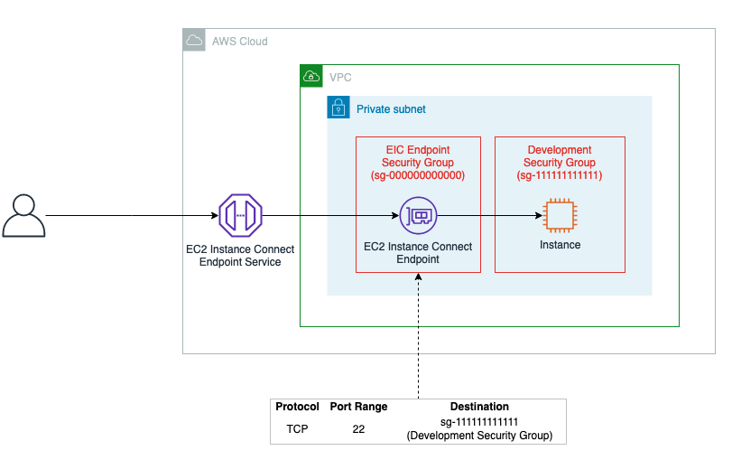

# Amazon EC2 Instance Connect Endpoint

## Overview

Imagine trying to connect to an Amazon Elastic Compute Cloud (Amazon EC2) instance within your Amazon Virtual Private Cloud (Amazon VPC) over the Internet. Typically, you’d first have to connect to a bastion host with a public IP address that your administrator set up over an Internet Gateway (IGW) in your VPC, and then use port forwarding to reach your destination.

Prior to the launch of Amazon EC2 Instance Connect Endpoints (EIC Endpoints), AWS offered two key services to help manage access from public address space into a VPC more carefully:

- EC2 Instance Connect: This service uses IAM credentials to push ephemeral SSH keys to an instance, making long-lived keys unnecessary. However, until now, EC2 Instance Connect required a public IP address on your instance when connecting over the Internet.
- Systems Manager Session Manager (SSM): This service provides agent-based connectivity to instances. SSM uses IAM for authentication and authorization, and is ideal for environments where an agent can be configured to run.

## What is Amazon EC2 Instance Connect Endpoint?

[Amazon EC2 Instance Connect (EIC) Endpoint](https://docs.aws.amazon.com/AWSEC2/latest/UserGuide/connect-using-eice.html) is an [interface endpoint](https://docs.aws.amazon.com/whitepapers/latest/aws-privatelink/what-are-vpc-endpoints.html#interface-endpoints) that allows you to connect to your Amazon Elastic Compute Cloud (EC2) instances in private subnets without requiring them to have a public IPv4 address. 

With an EIC Endpoint, you can eliminate the need for several traditional network components in your Virtual Private Cloud (VPC). This includes the removal of an Internet Gateway (IGW), the requirement for public IP addresses on your resources, the need for a bastion host, and any intermediary agents to connect to your resources.

EIC Endpoint brings together identity-based and network-based access controls, offering a comprehensive solution that delivers the isolation, control, and detailed logging necessary to fulfill organization's security requirements.


### Benefits 

- Securely connecting to your instances without requiring them to have a public IPv4 address.
- Eliminating the need for bastion hosts or agents.
- Making it easier to manage access to your instances by using IAM roles and policies.


### Limitations

- Only ports 22 and 3389 are supported.
- EC2 Instance Connect Endpoint doesn't support connections to an instance using IPv6 addresses.


## How it works?

- First, you create an EC2 Instance Connect Endpoint in a subnet in your virtual private cloud (VPC). Then, when you want to connect to an instance, you specify the ID of the instance. You can optionally provide the EC2 Instance Connect Endpoint. The endpoint acts as a private tunnel to the instance.

- Once you create an EC2 Instance Connect Endpoint in a subnet, you can use the endpoint to connect to any instance in any subnet in your VPC provided your VPC is configured to allow subnets to communicate.

**NOTE:** If you use an EC2 Instance Connect Endpoint in one subnet to connect to an instance in another subnet that is in a different Availability Zone, there is an additional charge for data transfer across Availability Zones.
 
The following figure shows an illustration of a user connecting via an EIC Endpoint:




## Permissions required

To create an EC2 Instance Connect Endpoint, users require permissions for the following actions:

    ec2:CreateInstanceConnectEndpoint

    ec2:CreateNetworkInterface

    ec2:CreateTags

    iam:CreateServiceLinkedRole

To describe and delete EC2 Instance Connect Endpoints, users require permissions for the following actions:

    ec2:DescribeInstanceConnectEndpoints

    ec2:DeleteInstanceConnectEndpoint


## Security groups


### EC2 Instance Connect Endpoint security group rule

Recommended outbound rule

- Allow outbound traffic to the specified destination (a security group or the VPC CIDR, depending on your security needs).

### Instance security group rule

Recommended inbound rules

- Allow inbound traffic from the EC2 Instance Connect Endpoint security group.
- Allow inbound traffic from the VPC CIDR so that any instances in the VPC can send traffic to the destination instance.

### Example

In the following image, the EC2 Instance Connect Endpoint is assigned the security group EIC Endpoint Security Group. The EIC Endpoint Security Group has one outbound rule that allows TCP traffic to the Development Security Group. This configuration means that the EC2 Instance Connect Endpoint can only send traffic to instances that are assigned the Development Security Group. In the image, the instance is assigned the Development Security Group, which means that, in this example, the EC2 Instance Connect Endpoint can send TCP traffic to the instance.




## Steps to create Instance connect Endpoint

1. Create an security group
```bash
aws ec2 create-security-group --description "endpoint security group" --group-name "endpoint-sg" --vpc-id "vpc-1a2b3c4dexample" 
```

2. Add Inbound rule to security group created above

```bash
aws ec2 authorize-security-group-ingress \
    --group-id sg-0b67d0a6bexample1 \
    --protocol tcp \
    --port 22 \
    --cidr 0.0.0.0/0
```

3. Add Outbound rule to security group created above

```bash
aws ec2 authorize-security-group-egress --group-id sg-0b67d0a6bexample1 --ip-permissions IpProtocol=tcp,FromPort=22,ToPort=22,UserIdGroupPairs='[{GroupId=sg-0bd67e12example2}]'
```

4. Add Inbound security group rule to ec2 instance security group

```bash
aws ec2 authorize-security-group-ingress \
    --group-id sg-0bd67e12example2 \
    --protocol tcp \
    --port 22 \
    --source-group sg-0b67d0a6bexample1
```

5. Create an ec2 instance connect endpoint
```bash
aws ec2 create-instance-connect-endpoint --subnet-id subnet-0123456789example --security-group-ids sg-0b67d0a6bexample1
```

## Connect to instance 

If you have all configuration right from above, you can use the below command to connect to ec2 instance using instance connect endpoint. 

```bash
ssh -i my-key-pair.pem ec2-user@i-0123456789example \
    -o ProxyCommand='aws ec2-instance-connect open-tunnel --instance-id i-0123456789example'
```

## Conclusion

EIC Endpoint provides a secure solution to connect to your instances via SSH or RDP in private subnets without IGWs, public IPs, agents, and bastion hosts. By configuring an EIC Endpoint for your VPC, you can securely connect using your existing client tools or the Console/AWS CLI. 


## References

- [Secure Connectivity from Public to Private: Introducing EC2 Instance Connect Endpoint](https://aws.amazon.com/blogs/compute/secure-connectivity-from-public-to-private-introducing-ec2-instance-connect-endpoint-june-13-2023/)
- [Connect to your instances without requiring a public IPv4 address using EC2 Instance Connect Endpoint](https://docs.aws.amazon.com/AWSEC2/latest/UserGuide/connect-with-ec2-instance-connect-endpoint.html)
- [Amazon EC2 Instance Connect supports SSH and RDP connectivity without public IP address](https://aws.amazon.com/about-aws/whats-new/2023/06/amazon-ec2-instance-connect-ssh-rdp-public-ip-address/)

